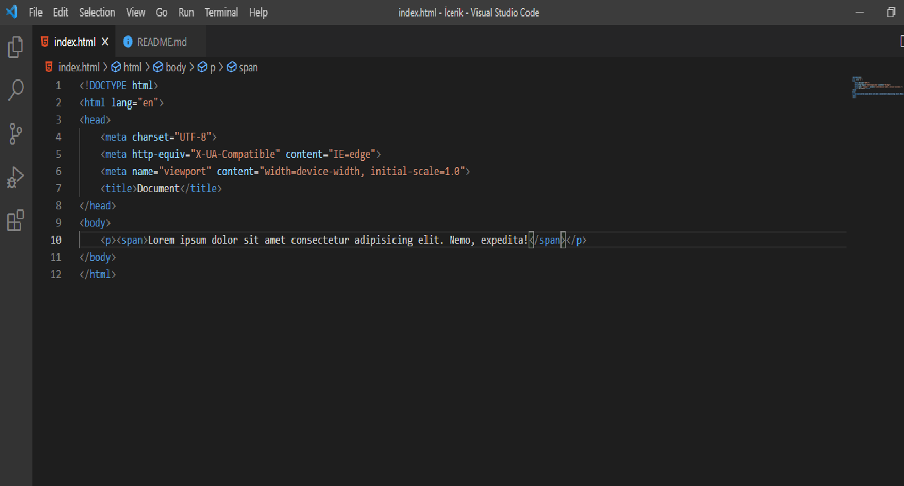

# Kodluyoruz Ilk Repo

Bu repo [Kodluyoruz](https://www.kodluyoruz.org/) Front-End eğitiminde oluşturduğumuz ilk repo. İçerisinde bir adet README dosyası, bir adet de index.html barındırıyor.

# Installation 

Öncelikle projeyi clonelayın. (Buraya sizin reponuzdan aldığınız link gelecek)

    git clone https://github.com/onurtugrul/kodluyoruzilkrepo.git

# Usage

Projeyi cloneladıktan sonra Visual Studio Code programında açınız.

    Linux için:
    cd kodluyoruzilkrepo
    code .

# Contributing

Pull requestler kabul edilir. Büyük değişiklikler için, lütfen önce neyi değiştirmek istediğinizi tartışmak için bir konu açınız.

# License

[MIT](https://github.com/onurtugrul/kodluyoruzilkrepo/blob/main/LICENSE)